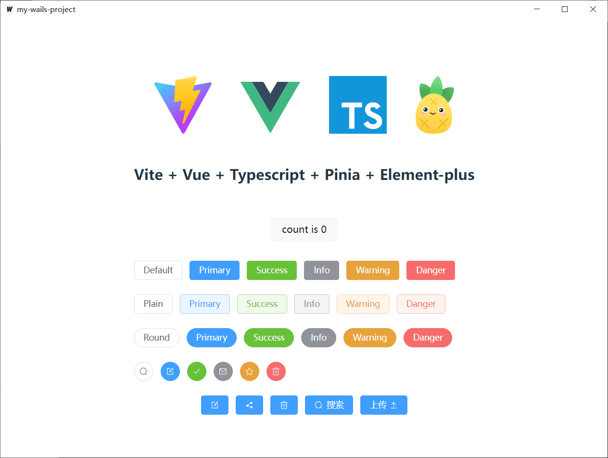

# README

## About

A template for Wails with Vite + Vue + TypeScript + ElementPlus + Pinia.

## How to use?
```
git clone https://github.com/id88/wails-vite-vue-ts-element.git

wails init -n my-wails-project -t wails-vite-vue-ts-element

cd my-wails-project

wails dev
```



## Live Development

To run in live development mode, run `wails dev` in the project directory. In another terminal, go into the `frontend`
directory and run `npm run dev`. The frontend dev server will run on http://localhost:34115. Connect to this in your
browser and connect to your application.

## Building

To build a redistributable, production mode package, use `wails build`.
